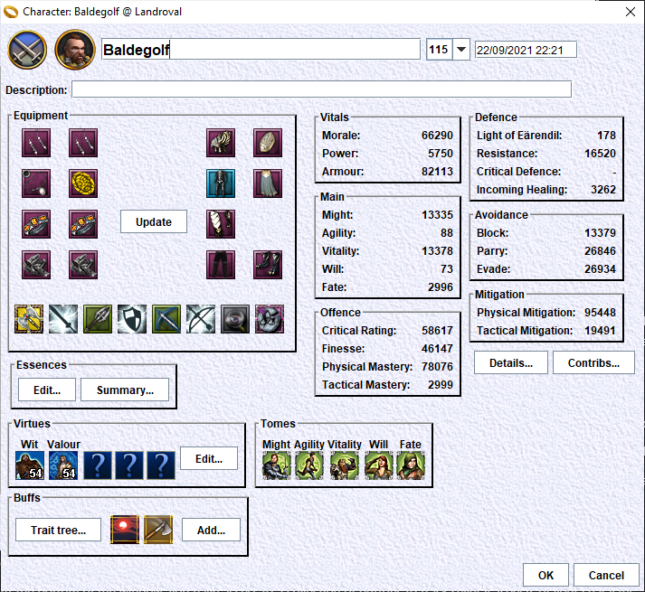

# Character configuration edition
From the main window for a character, double click on a row of the 'Configurations' table to edit this configuration.
It will bring a 'character configuration' edition window.

This window will display the real or simulated state of a character a given time.
This includes:
    - level
    - equipment
    - traits, buffs
    - virtues
    - stat tomes
    - result stats

This window also gives access to detailed analysis/edition tools:
- detailed stats window: contains more stats than in the parent window. Click on the stat names (hyperlinks) to get a window with the 'rating to percentage' curves for this stat
- stats contributions analyzer: let you see where do stats come from
- essences editor: to quickly edit essences on all the available slots
- essences summary

## Equipment edition
Click on an empty slot. This will bring a window to choose the item for this slot. If the slot already contains an item, then right-click on edit to get a contextual menu. In this menu, click on 'Choose item...'.

On a slot with an item, click on the item to display its characteristics and edit them.

After each change, the character stats will be recomputed.

## Traits and buffs edition
To add a trait or a buff, click on the 'Add...' button. Choose a trait or buff. Click on OK.
The character stats will be recomputed.
To change the tier of a tiered trait, click on it.
To remove a trait or buff, right-click on it and choose 'Remove' in the contextul menu.

## Virtues edition
Click on the 'Edit...' button of the 'Virtues' frame. This will bring a window to edit the virtues.
WHen this window is closed, the character stats are be recomputed.

## Stat tomes edition
Click on one of the 5 stat tome icons to add one tier on it.
The character stats are recomputed after each change.

## Detailed stats
Click on the 'Details...' button to get the 'Detailed stats' window.
Note that if you keep this window opened, then each change in the configuration will be reflected as green '+' or red '-' differences.

## Stats contributions analyzer
Click on the 'Contributions...' button to get the 'Contributions...' window.

## Essences edition
Click on the 'Essences...' button to get the essences edition window.
From this window, you can edit all the stats of all the items in your configuration.

## Essences summary
Click on the 'Summary...' button to get a summary view of essences.
