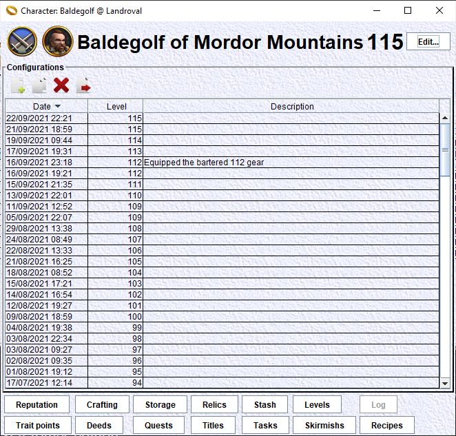

# Character window
Each character has a dedicated window. This window is used to consult all the elements of this character. A subset of theses elements are editable.

From the main window, double click on the row of the character to use. This will bring the main window for this character. This is the window we present here.
From this window, you will perform all the actions for this character:
- edit main characteristics
- edit the character configurations
- consult or edit a lot of specific aspects of the character

## Main characteristics edition
The 'Edit...' button brings a window where you can edit the main characteristics of this character:
    - name (you may change the name of your character if ever it changes in game)
    - server (you may change the server if your relocate your character to another server)
    - sex
    - region
    - class
    - race
    - level

## Character configurations
In this window, we have a table of 'configurations'. Each configuration contains the real or simulated configuration of your character at a given date.

When the character is created, a 'character configuration' is created for it, that reflects the state of a new character (level 1) for this race and class.

When a character is imported from the game client (with 'Current Gear' ticked), a new 'character configuration' is created for it, that reflects the current state of the character in the game (level, gear, virtues...).

A detailed presentation of the 'Character Configuration' window is available [HERE](../CharacterConfigurationEdition/CharacterConfigurationEdition.md).

## Character status
At the bottom of the window, you have access to a collection of buttons to track several aspects of your character:
    - reputation status
    - crafting status
    - storage
    - relics inventory
    - stash
    - levels history
    - log
    - trait points status
    - deeds status
    - quests status
    - titles status
    - tasks statistics
    - skirmishs statistics
    - recipes status

### Reputation status
Click on the 'Reputation' button. This will bring a window to edit your reputation status and levelling history.

### Crafting status
Click on the 'Crafting' button. This will bring a window to edit your crafting status and levelling history.

### Storage
Click on the 'Storage' button. This will bring a window to show the contents of bags and vaults.

### Relics
Click on the 'Relics' button. This will bring a window to show your relics inventory.

### Stash
Click on the 'Stash' button. This will bring a window to show the contents of your stash. Your stash is a virtual space where you can put item instances to be used in character gear simulation.

### Levels history
Click on the 'Levels' button. This will bring a window to edit your levelling history.

### Log
Click on the 'Log' button. This will bring a window that shows the character log of this character. This log was imported from the 'my.lotro.com' web site. The button will be disabled if the character has no character log. Otherwise, the window will show the last state of this log.
As the mentioned site does not exist anymore, the character log import does not work anymore.

### Trait points status
Click on the 'Trait points' button. This will bring a window to display and edit your trait points.

### Deeds status
Click on the 'Deeds' button. This will bring a window to display and edit your deeds status.

### Quests status
Click on the 'Quests' button. This will bring a window to display your quests status.

### Titles status
Click on the 'Titles' button. This will bring a window to display your titles status.

### Tasks statistics
Click on the 'Tasks' button. This will bring a window to display some statistics about your tasks.

### Skimirsh statistics
Click on the 'Skirmishs' button. This will bring a window to display some statistics about your skirmishs history.

### Recipes status
Click on the 'Recipes' button. This will bring a window to display your recipes status.
