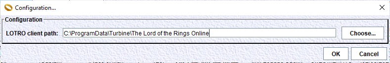

# Configuration of the LotroCompanion desktop application

Here we explain how to configure the application.

Click on the 'Settings...' icon from the main toolbar.
This will bring the configuration window for this application:

We can configure:
- the path of the game client.

## Path of the game client
On first startup, the application will try to find the directory of your game client. It will try to use several well known possible locations for it.
If your game client installation is not in one of these 'standard' locations, then your will have to edit it here.

When you choose a directory, it will check for the presence of some well known files (like some .DAT files).

If the game client path is not set correctly then several issues will occur:
- the 'satellite' (or eagle view) layer of the maps will not display. Maps background will only contain either a parchment map or a dungeon map.
- the character data import from the game client may not work correctly.

## Other configurable elements

Some other elements may be configured using a configuration file (and not using the Settings window).

The configuration file can be found in the LotroCompanion directory:

    app/data/config/params.txt

### Default server used during character creation:

    # Default server to use in the new toon window (OPTIONAL)
    default.server=Landroval

The list of available servers can be found in the file *servers.txt* in the same directory as the file *params.txt*.
