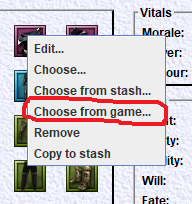
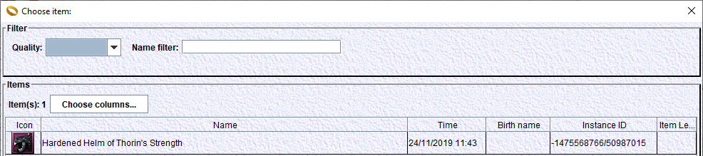

# How to get items from the game into Lotro Companion

Here you will learn how to export the complete definition of in-game item instances into the LotroCompanion desktop application.

## Pre-requisites
The 'LotroCompanion' plugin must be installed and started for the character(s) you use. Installation is described .
The game client and the LotroCompanion have to run on the same PC (because they will share files).
In order to get the items for a character, this character has to be defined in LotroCompanion with the same server, account and name. This is because the path of the file used for exchanges does contain those 3 values.

## Principle
The export of game items to Lotro Companion uses the 'link item in chat' feature of the game client.
Using Ctrl-Right click on an item will 'link' it in the chat. This is normally used to share the definition of an item with the users you're chatting with.

The 'LotroCompanion' plugin installs a chat hook that intercepts these links and write the data contained in it into a file.
This file is then read by the LotroCompanion desktop application that decodes it into a collection of item instances.
This file contains the last 100 items that you linked for that character.

This file is: <plugins data dir>\<account name>\<server name>\<character name>\LotroCompanionItems.plugindata
Where <plugins data dir> is <user home>\Documents\The Lord of the Rings Online.

## Configuration

You may need to configure the path where LotroCompanion can find the data files of the game plugins.
This is described .

## How to
- Start the game client and connect with the character you want.

- Start LotroCompanion. Open a 'character configuration' window for this character.
- In the game:
	- start item capture: type this command in the chat:

     /lc start

	You should get a message like this one to indicate that the item capture has been enabled. Now all items linked into the chat (in both received or sent messages) will be saved.

    

	- link the item you need into the chat. The item may come from your equipped items or from your bag. Currently, only one item may be present in each chat message. Press enter to send the message that contains the link. You get a message 'Got an item' in addition to the 'say' notification:

    

- In the application:
	- right click on the item slot to use for the linked item (the head slot here), and choose 'Import from game...':

    

    This will bring a window to choose between the possible items. You should find the item you just linked, in addition to all previous items you linked that fit in that slot:

    

Here is the item in game, and in the application. See how stats and essences are faithfully imported.

      

- In the game:
	- stop items capture when you want: type this command in the chat:

    /lc stop

	You should get a message like this one to indicate that the item capture has been disabled..

	

Note that the LotroCompanion desktop application only needs the file that contains item links. Once an item is linked into the game client chat, then it will persist in the file until it is dropped because too many items were linked afterwards.
So:
- you don't need the game client if items were already linked.
- you may see in the application some items that were linked in previous sessions.

## Tips
### Chat channel to use
Choose carefully the chat channel you're using. You don't want connected people to hear the exact collection of items you're trying to export. That pollutes their game experience.
For instance, the default channel will be heard by the players in the same area.
Using the Kinship channel is not a good idea. All your connected kinmates will hear you.

One thing I usually do is to travel to my personal house.
Then I link my items into the chat.

## Known bugs
It is well known as a long time bug, that some items in the game won't link in the chat.
For instance, a lot of legendary imbued items do not work. As a workaround, it is possible to create/update those items manually in the application.

## Possible issues
It is still possible that items linked in the chat won't appear in the chooser inside the application. This may happen for different reasons:
- the item is quite new and the application is old, so that it does not know the item in its internal database.
- the linked item contains unsupported data ('properties'): that prevents its successful decoding.
During the item capture session, you may capture items linked in the chat by other players.
