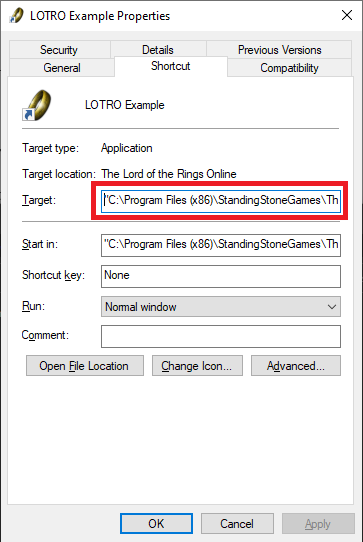

# A discussion on Admin Rights for Lotro Companion

Here I'd like to thank b414213562, author of plugins for LotRO, and especially the ["Deed Tracker"](https://www.lotrointerface.com/downloads/info1139-DeedTracker.html) plugin that works nicely hand in hand with LotroCompanion.

A summary is: depending on the command line parameters used to start the LotRO launcher, then LotroCompanion may need the admin rights, or not.

Here I quote a message of b414213562 in the Discord server: Lotro Companion's corner.

b414213562: LOTRO Command-line Parameters
When launching LOTRO on Windows, you can modify the behavior of the launcher with additional parameters:

*-nosplash* - skips the splash screen

*-skiprawdownload* - skips the attempt to install the Visual C++ Redistributable Packages. Installing these requires a User Access Control (UAC) prompt saying something like "Do you want to allow this app to make changes to your device.". If you say yes, it re-launches LOTRO as if an administrator were running it, which means LOTRO Companion must also be run as an administrator. Passing this command-line parameter skips the UAC dialog and means LOTRO Companion does not need to be run as an administrator

*-username "[your_username]"* - Replace [your_username] with your LOTRO Username. For instance, if your LOTRO Username was "mylotrouser", this would be -username "mylotrouser". DO NOT do this on a machine you share with untrusted people. Anyone who can see the shortcut (basically everyone, if the shortcut is on the Start Menu) can also see these values.

*-password "[your_password]"* - Replace [your_password] with your LOTRO Password. For instance, if your LOTRO Password was "1 2 3 4 5", this would be -password "1 2 3 4 5". DO NOT do this on a machine you share with untrusted people. Anyone who can see the shortcut (basically everyone, if the shortcut is on the Start Menu) can also see these values.

To add any of these, right click your shortcut to LOTRO and select Properties. You want to change the line labeled Target: The starting part of this line is the location of your LOTRO client. Add the parameters after that. For example, on my computer it might look like: (only change the part in bold, and only do the username and password parts if you do not share it with untrusted people.)

Target: "**C:\Program Files (x86)\StandingStoneGames\The Lord of the Rings Online**\LotroLauncher.exe" -nosplash -skiprawdownload -username "[your_username]" -password "[your_password]"

Note:

*-skiprawdownload* Also skips updating files in the raw directory, like logos and splash screens each time you run LOTRO. Because of this, I recommend launching LOTRO occasionally (such as after each patch) without this parameter, in case a raw file has changed.
