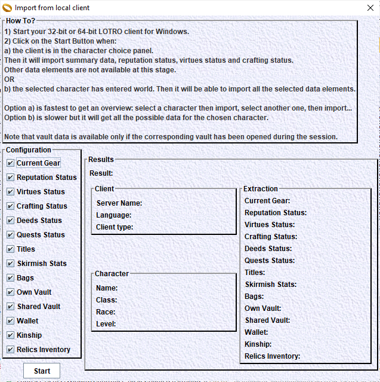
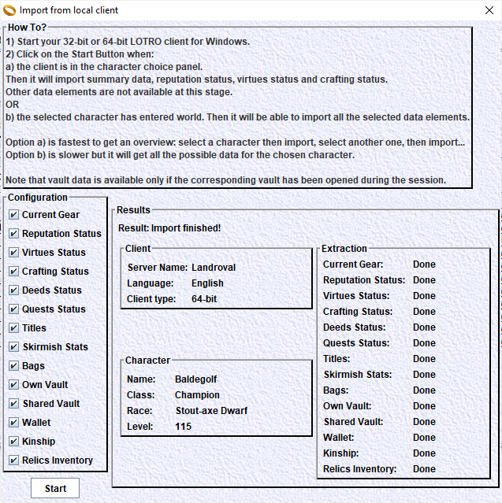

# Character data import from the local game client

## Setup
The LotroCompanion application shall be properly configured.
Especially, the installation directory of the client shall be correct. See [HERE](../HowTo/ApplicationConfiguration/main.md) for details.

## Import
Start your game client. Select the character you want to use and enter the Middle Earth.

Click on the 'Import from LotRO' button. This will bring the window 'Import from local client'.

Scope selection:
On the left side of the window, select the elements to import. Default is to import everything we support.

Click on the 'Start' button.

The application will connect to the local client and grab data about the connected character.
It will either create a new character or update it if it already exists.
You shall see the import progress displayed on the window.

At the end of the import, it shall display "Import Finished" or "Import failed".
The status of each selected import element will be shown in the bottom right part as "Done", "Not Found" or "Failed".

Here is a finished import screenshot:

# Troubleshooting
## Connection failure
One of the reason for a connection failure is that LotroCompanion may require admin rights to be able to connect to the game client.

Depending on how the client is started, admin rights are required or not for the import to work in LotroCompanion.
See details [HERE](AdminRights.md).

